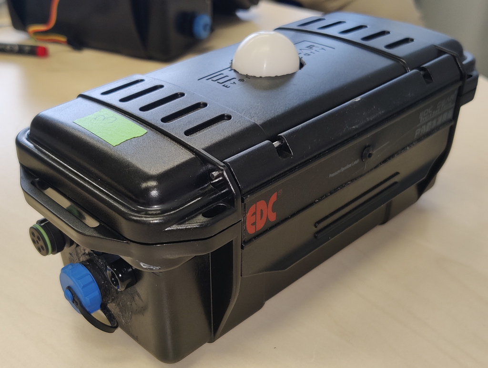
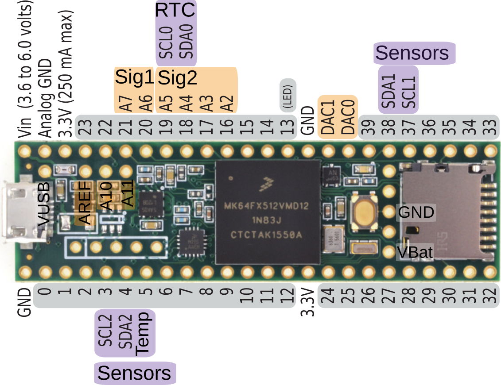

# eodlogger_4channel_sensors



- Records from 2x2 monopolar channels against a common ground (banana
  jack), two from each ADC (A2, A3, A10, A11).
- Data are saved in wave files together with relevant metadata:
  sampling rate, number of channels and pin IDs, bit resolution,
  data and time, Teensy board version and its unique MAC address.
- Data acquisition (sampling rate, channels, averaging, etc.) can
  be easily changed.
- Environmental sensor data (water temperature via
  [DS18x20](https://github.com/janscience/ESensors/blob/main/docs/chips/ds18x20.md),
  light intensity via
  [BH1750](https://github.com/janscience/ESensors/blob/main/docs/chips/bh1750.md))
  are also logged onto SD card.
- A configuration file can be used to setup the logger.


## Dependencies and installation

The logger is based on the following libraries:

- [TeeRec](https://github.com/janscience/TeeRec) library.
- [ESensors](https://github.com/janscience/ESensors) library.

Both can be installed from the library manager of the Arduino IDE.


*Note:* you need Arduino IDE 2.x.x and
 [Teensyduino](https://www.pjrc.com/teensy/td_download.html) 1.58 or
 higher! See the [TeeRec installation
 instructions](https://github.com/janscience/TeeRec/blob/main/docs/install.md)
 and the [ESensors installation
 instructions](https://github.com/janscience/ESensors/blob/main/docs/install.md)
 for details.


## Setup

Open the `eodlogger_4channel_sensors` sketch in the Arduino IDE.


### Real-time clock

If an external [DS1307, DS1337 or DS3231
  chip](https://www.pjrc.com/teensy/td_libs_DS1307RTC.html) is
  detected it is used as the real time clock instead of the on-board
  one. The DS1307, DS1337 or DS3231 need to be set by running, for
  example, the `SetTime` sketch. You find it in File -> Examples ->
  DS1307RTC -> SetTime. Open it and run it.

The [onboard real-time
clock](https://www.pjrc.com/teensy/td_libs_Time.html) is set whenever
you compile and upload a sketch.

### Data acquisition

In the top section marked as "Default settings" you may adapt some settings
according to your needs. The first block is about the data
acquisition. You can set the sampling rate, input pins (channels), bit
resolution, and number of averages per sample. If you change these
settings, check the output on the serial monitor and the performance
before using the logger! See
[TeeRec](https://github.com/janscience/TeeRec) for various sketches
and tools that help you to select the best settings for the data
acquisition.

### File size and naming

The second section is about the files that store the data on the SD
card.  The files are stored in a directory whose name is specified by
the `path` variable. The file names in this directory are specified by
the `fileName` variable. The 'wav' extension is added by the
sketch. The following special strings in the file name are replaced by
the current date, time or a number:

- `DATE`: the current data as ISO string (YYYY-MM-DD)
- `SDATE`: "short date" - the current date as YYYYMMDD
- `TIME`: the current time as ISO string but with dashes instead of colons (HH-MM-SS)
- `STIME`: "short time" - the current time as HHMMSS
- `DATETIME`: the current date and time as YYYY-MM-DDTHH-MM-SS
- `SDATETIME`: "short data and time" - the current date and time as YYYYMMDDTHHMMSS
- `ANUM`: a two character string numbering the files: 'aa', 'ab', 'ac', ..., 'ba', 'bb', ...
- `NUM`: a two character string numbering the files: '01', '02', '03', ..., '10', '11', ...
- `NUNM3`, `NUM4`, ...: like `NUM`, but with 3, 4, or more digets.

`fileSaveTime` specifies for how many seconds data should be saved into
each file. The default is 10min.

`initialDelay` specifies an initial delay right after start up the
sketch waits before starting to store data on SD card.

Once you modified the sketch to your needs, compile and upload it to
the Teensy (`Ctrl-U`).


## Configuration

Most of the settings described above can be configured via a
configuration file. Simply place a configuration file named
`logger.cfg` into the root folder of the SD card. If present, this
file is read once on startup. You find an example configuration file
along with the logger sketch in this directory. The content should
look like this:

```txt
# Configuration file for EOD logger.

Settings:
  Path: recordings       # path where to store data
  FileName: logger1-SDATETIME  # may include DATE, SDATE, TIME, STIME, DATETIME, SDATETIME, ANUM, NUM
  FileTime: 10min        # s, min, or h
  InitialDelay: 10s      # ms, s, or min

ADC:
  SamplingRate: 44.1kHz  # Hz, kHz, or MHz
  Averaging   : 4
  Conversion  : high
  Sampling    : high
  Resolution  : 12bit
  Reference   : 3.3V
``` 

Everything behind '#' is a comment. All lines without a colon are
ignored, that is empty lines are ignored, but also lines with text
without colon.  Matching keys and most values is case
insensitive. Unknown keys are ignored but reported. Times and
frequencies understand various units as indicated in the
comments. Check the serial monitor of the Arduino IDE (`Ctrl+Shif+M`)
to confirm the right settings.

The only relevant parameter might be the `FileName`. Choose for each
of your loggers a different base name!


## Real-time clock

For proper naming of files, the real-time clock needs to be set to the
right time. The easiest way to achieve this, is to compile and upload
the [`eodlogger_4channel_sensors.ino`](eodlogger_4channel_sensors.ino)
sketch from the Arduino IDE.

Alternatively, you may copy a file named `settime.cfg` into the root
folder of the SD card. This file contains a single line with a date
and a time in the following format:
``` txt
YYYY-MM-DDTHH:MM:SS
```

In a shell you might generate this file via
``` sh
date +%FT%T > settime.cfg
```
and then edit this file to some time in the near future.

Insert the SD card into the Teensy. Start the Teensy by connecting it
to power. On start up the
[`eodlogger_4channel_sensors.ino`](eodlogger_4channel_sensors.ino)
sketch reads in the `settime.cfg` file, sets the real-time clock to
this time, and then deletes the file from the SD card to avoid
resetting the time at the next start up.


## Logging

1. *Format the SD card.*
2. Copy your logger.cfg file onto the SD card.
3. Insert the SD card into the Teensy.
4. Connect the Teensy to a battery and let it record the data.

The SD card needs to be *reformatted after every usage* of the
logger. The logger runs until the battery is drained and therefore
cannot properly close the last files. This leaves the file system in a
corrupted state, which apparently results in very long delays when
writing to the SD card again.

You may use the sketch provided by the SdFat library for formatting
the SD card directly on the Teensy: In the Arduino IDE menu select
File - Examples, browse down, select "SdFat" and then
"SdFormatter". Upload the script on Teensy and open the serial
monitor. Follow the instructions and do an erase and format.


### LED

The on-board LED of the Teensy indicates the following events:

- On startup the LED is switched on during the initialization of the
  data acqusition and SD card. This can last for up to 2 seconds
  (timeout for establishing a serial connection with a computer).

- For the time of the initial delay (nothing is recorded to SD card)
  a double-blink every 2s is emitted.

- Normal operation, i.e. data acquisition is running and data are
  written to SD card: the LED briefly flashes every 5 seconds.

- Whenever a file is closed (and a new one opened), the LED lights for
  1 second. Then it continues with flashes every 5 seconds.

- The LED is switched off completely if no data can be written on the
  SD card (no SD card present or SD card full) or data acquisition is
  not working.  Connect the Teensy to a computer and open the serial
  monitor of the Arduino IDE (`Ctrl+Shift+M`). On startup the settings
  for the data acquisition are reported and in case of problems an
  error message is displayed.


## Assembly



